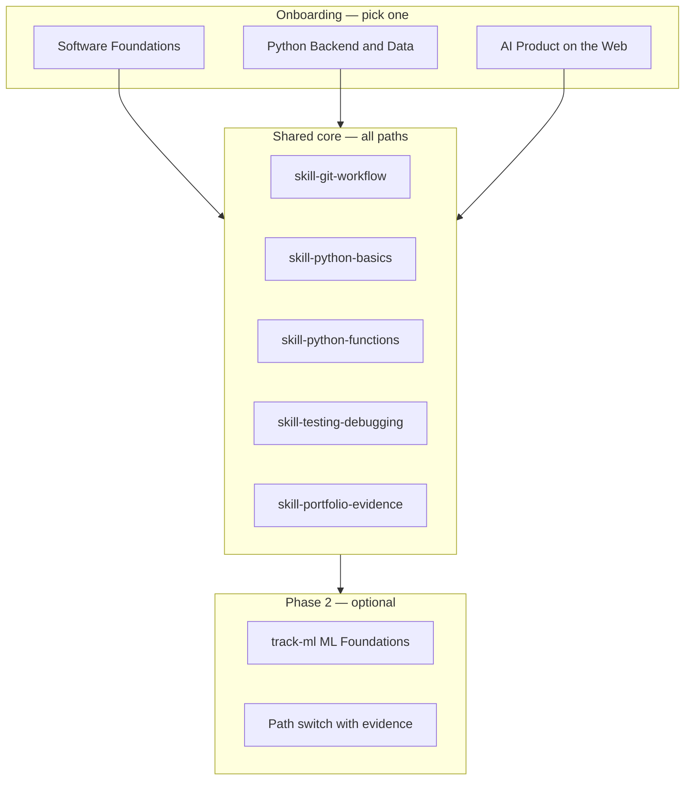
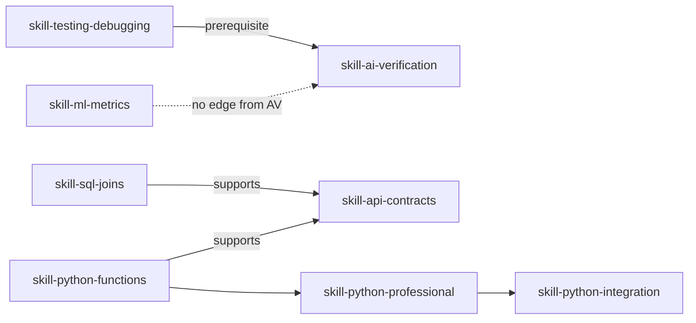
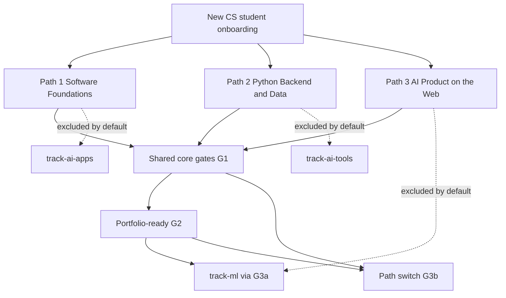

# Career paths architecture (2026)

**Status:** Product architecture (doc-only). Implements no routing changes by itself.  
**Companion:** [career-paths-2026.md](./career-paths-2026.md) (market + role summaries).  
**Code anchors:** `src/content/roles.ts`, `src/domain/role-routing.ts`, `src/content/seed.ts`, `app/onboarding.tsx`.

---

## Executive summary

CareerForge Mobile should expose **exactly three parallel learner paths** for new CS students—chosen at onboarding, not climbed as a single “junior → senior” ladder. Depth comes from **skill prerequisites and verifier-backed evidence**, not job-title vanity.

| Recommended learner-facing name | Stable role ID | Primary hiring story |
| --- | --- | --- |
| **Software Foundations** | `role-junior-swe` | First internship / generalist junior |
| **Python Backend & Data** | `role-python-fullstack` | APIs, SQL, Python services |
| **AI Product on the Web** | `role-ai-app-fullstack` | LLM features, evals, typed UI |

**Phase 2** (all paths): optional `track-ml` after **shared core** skills + proof—not after “becoming senior,” and **not** as a linear sequel to the AI product path.

---

## Design principles

1. **Parallel entry, shared spine.** All three paths assume zero prior professional experience. Pick one story at onboarding; do not force Path B before Path A by title.
2. **Gates use skills + evidence.** Readiness % (`calculateReadinessScore` in `src/domain/readiness.ts`) is role-scoped and mission-heavy (40% projects, 30% evidence). Gates combine **required skills** (from `contentPack.skillEdges`) with **minimum readiness** and **mission evidence**, not seniority labels.
3. **Keep three stable role IDs.** Display copy may evolve; saved progress keys must not churn without a migration.
4. **`track-ml` stays unwired** in `roles.ts` until phase-2 gate logic exists in product (Settings toggle or post-core unlock).

---

## Why not “Junior → Senior” as one ladder?

| Issue | Reality in this app |
| --- | --- |
| **Content gap** | `roleTargets` has three **entry-level** targets only. No `role-senior-*`, no senior missions, no staff-level skill nodes. |
| **Skill graph size** | Eleven skills, shallow edges—enough for foundations → applied → portfolio proof, not a multi-year career arc. |
| **Readiness semantics** | Labels are `starting` / `building` / `portfolio-ready` (≥70), not job level. A high score means **proof quality**, not “senior engineer.” |
| **Hiring mismatch** | “Senior” implies scope, system design, and mentorship evidence the seed pack does not assess. |

### Recommended model: shared core + three lateral paths + phase 2

**Depth within a path** (learner-visible, not separate role IDs):

| Tier | Name (UI) | Meaning |
| --- | --- | --- |
| T0 | Start here | Weeks 1–2 checklist; first lesson + first portfolio note |
| T1 | Core proof | Path `trackIds` in flight; ≥1 mission completed; readiness `building` (≥35) |
| T2 | Portfolio-ready | Readiness ≥70; evidence hygiene >0; path-specific differentiator mission |
| T3 | Phase 2 | `track-ml` or cross-path enrichment (gated) |

---

## The three learner paths (detail)

### Path 1 — Software Foundations

| Field | Value |
| --- | --- |
| **Display name** | Software Foundations |
| **Role ID** | `role-junior-swe` (default) |
| **Audience** | New CS students targeting internships and junior generalist roles; breadth over niche. |
| **Weeks 1–2 (start here)** | First Python lesson (`lesson-python-values` → functions path); first Git evidence lesson; **one passing Code Lab**; **one Portfolio entry** (verifier output + short reflection). |
| **Core stack** | Python, TypeScript (UI contracts), SQL, Git, AI-assisted coding (verify, don’t trust). |
| **Differentiator** | **AI output custody:** what you changed, what tests caught, what you refused to ship. |
| **Phase 2 unlock** | Optional **ML Foundations** (`track-ml`) after shared core gate (table below). Practical AI Apps remain excluded by default—use path switch if product/RAG depth is needed. |

**Track map:** `track-python` → `track-typescript` → `track-sql` → `track-git` → `track-ai-tools`  
**Excluded:** `track-ai-apps`, `track-ml`

---

### Path 2 — Python Backend & Data

| Field | Value |
| --- | --- |
| **Display name** | Python Backend & Data |
| **Role ID** | `role-python-fullstack` |
| **Audience** | Students aiming at backend-leaning full-stack or data-facing API roles (“Python + SQL + services” postings). |
| **Weeks 1–2 (start here)** | Python core through first functions lesson; **first SQL module** (`module-sql-core`); mission skew: CLI/data cleanup with **repo + test output** in Portfolio. |
| **Core stack** | Python (depth), SQL, TypeScript for API/UI contracts, Git, Practical AI Apps (boundaries/evals—not training). |
| **Differentiator** | **Data + API proof:** schema, queries, small service, README with run commands. |
| **Phase 2 unlock** | `track-ml` after shared core + **`skill-sql-joins`** + **`skill-api-contracts`** (from SQL + Python integration modules). AI-Assisted Coding (`track-ai-tools`) available via **path switch**, not default unlock. |

**Track map:** `track-python` → `track-sql` → `track-typescript` → `track-git` → `track-ai-apps`  
**Excluded:** `track-ai-tools`, `track-ml`

---

### Path 3 — AI Product on the Web

| Field | Value |
| --- | --- |
| **Display name** | AI Product on the Web |
| **Role ID** | `role-ai-app-fullstack` |
| **Audience** | Students targeting LLM-backed product work (RAG, routers, evals, guardrails) on a TypeScript-first surface. |
| **Weeks 1–2 (start here)** | TypeScript core lesson; **AI verification habits** (`module-ai-verification`); Portfolio note documenting **one safety or eval decision**. |
| **Core stack** | TypeScript, AI-Assisted Coding, Practical AI Apps, SQL, Python (supporting), Git. |
| **Differentiator** | **Eval + safety narrative:** what you measured, what failed, what never ships. |
| **Phase 2 unlock** | `track-ml` only after **`skill-ai-verification`** + **`skill-api-contracts`** (from AI apps module) **and** shared core—see AI vs ML section. |

**Track map:** `track-typescript` → `track-ai-tools` → `track-ai-apps` → `track-sql` → `track-python` → `track-git`  
**Excluded:** `track-ml` (until phase 2 gate)

---

## AI product engineer → ML engineer?

**Verdict: do not model as a single linear ladder.** Treat **AI product** (`track-ai-tools` + `track-ai-apps`) and **ML foundations** (`track-ml`) as **parallel phase-2 branches** off shared core, with different skill entry requirements.

### Skill graph evidence (from `seed.ts`)

- `skill-ai-verification` is required for AI app lessons (both AI modules list it).
- `skill-ml-metrics` appears only in `module-ml-core`; **no** `prerequisite` edge from `skill-ai-verification` → `skill-ml-metrics`.
- ML module also lists `skill-testing-debugging`, not RAG/eval skills.

| Transition | Supported by graph? | Product stance |
| --- | --- | --- |
| AI verification → AI apps (RAG, boundaries) | Yes (`testing-debugging` → `ai-verification`; apps use `api-contracts`) | **In-path** for `role-ai-app-fullstack` |
| AI apps → ML metrics | **No dedicated edge** | **Phase 2 optional**, not “level 3 of AI career” |
| Python integration → ML | Partial (shared `testing-debugging`; data fluency via SQL/Python) | **Preferred ML entry** for `role-python-fullstack` / `role-junior-swe` |
| “AI engineer” job title → “ML engineer” job title | N/A (titles not in graph) | **Separate parallel unlock**, same phase-2 band |

**Learner copy:** “ML Foundations explains model metrics and limits; it does not teach you to ship RAG. Finish your path’s core proof first.”

---

## Progression gates

Gates are **evidence-first**. Percentages use **role-filtered** content (`getContentForRole`) so learners are not penalized for tracks outside their path.

### Gate summary (quick reference)

| Gate ID | Unlocks | Requires (all paths) | Path-specific extra |
| --- | --- | --- | --- |
| **G0** | Dashboard after onboarding | Role selected | — |
| **G1** | T1 “Core proof” band | Shared core skills (table); ≥1 completed mission in-role; readiness ≥35 | Path “weeks 1–2” checklist done |
| **G2** | T2 “Portfolio-ready” | Readiness ≥70; evidence hygiene >0; ≥1 mission with passing verifier + repo or artifact | Path differentiator mission (below) |
| **G3a** | `track-ml` (phase 2) | G1 + shared core + readiness ≥55 | See G3a branches |
| **G3b** | Path switch (Settings) | G1 met on **current** path | Target path **start-here** skills OR readiness ≥25 on target’s first track |
| **G3c** | Enrich excluded track (no role change) | G2 on current path | Product policy: show as “Add track” not auto-merge |

### Shared core (skill translation)

These skills are the **spine** every path must prove before phase 2 or a confident path switch:

| Skill ID | How it is demonstrated in app |
| --- | --- |
| `skill-git-workflow` | Git track lessons + `mission-portfolio-readme` or linked repo evidence |
| `skill-python-basics` | First Python module lessons + Code Lab pass |
| `skill-python-functions` | Functions / CLI slice lessons; supports `skill-api-contracts` |
| `skill-testing-debugging` | Quiz + mini-project verifier passes; prerequisite for `skill-ai-verification` |
| `skill-portfolio-evidence` | Portfolio item with verifier output + reflection (`git-workflow` supports this) |

**Shared core completion (recommended rule):** all five skills have at least one **completed lesson** mapping each skill **and** `skill-portfolio-evidence` backed by evidence hygiene ≥40 on one linked item.

### Path-specific differentiator (G2)

| Role ID | Differentiator mission / skill signal |
| --- | --- |
| `role-junior-swe` | `mission-ai-test-harness` **or** first TS lesson + AI diff review; `skill-ai-verification` present |
| `role-python-fullstack` | `mission-sql-portfolio-ledger` or `mission-job-tracker-schema`; `skill-sql-joins` + toward `skill-api-contracts` |
| `role-ai-app-fullstack` | `mission-rag-notes-prototype` or `mission-ai-study-planner`; `skill-api-contracts` + eval reflection in Portfolio |

### G3a — `track-ml` unlock branches

`track-ml` is **not** in any `roleTargets[].trackIds` today. When wired, use **branch** rules (not one global %):

| Branch | Best for | Extra skills beyond shared core |
| --- | --- | --- |
| **ML-A (data path)** | `role-junior-swe`, `role-python-fullstack` | `skill-sql-joins`; `skill-python-functions`; readiness ≥55 |
| **ML-B (model literacy)** | Any path after G2 | `skill-testing-debugging` at G2 level; **either** `skill-python-integration` **or** `skill-ai-verification` (proves disciplined measurement before metrics) |

**Do not** auto-attach `track-ml` to `role-ai-app-fullstack` on role select—avoids three AI-labeled tracks at once (see [career-paths-2026.md](./career-paths-2026.md)).

### G3b — Path switch (lateral, not promotion)

Switching roles **does not reset** progress (`onboarding.tsx` copy). Gates prevent **unfocused hopping**:

| From → To | Justification |
| --- | --- |
| Foundations → Python Backend | Learner has `skill-python-functions` + wants SQL/API depth; optional: readiness on `track-sql` first lesson attempted |
| Foundations → AI Product | Requires `skill-testing-debugging` (else AI track violates prerequisite graph) |
| Python Backend → AI Product | Needs `skill-api-contracts` signal (SQL + Python path) **or** complete `track-ai-apps` boundary lesson after switch |
| AI Product → Python Backend | Needs `skill-python-professional` or integration mission—not “demotion,” different proof story |

**Rule:** Path B is **not** unlocked because Path A reached 80% readiness. Unlock **switch** when **target path start-here skills** ≥1 or hiring intent changes (explicit user action).

### Gate table (machine-oriented)

| Gate | `progressionTier` (proposed) | Readiness (role-scoped) | Skills (IDs) | Missions / evidence |
| --- | --- | --- | --- | --- |
| G0 | `onboarding` | any | — | role selected |
| G1 | `core-proof` | ≥35 (`building`) | shared core all touched | ≥1 in-role mission complete |
| G2 | `portfolio-ready` | ≥70 | path differentiator skills | passing verifier + repo/artifact on mission |
| G3a-ML-A | `phase-2-ml-data` | ≥55 | shared + `skill-sql-joins` | optional: SQL mission complete |
| G3a-ML-B | `phase-2-ml-metrics` | ≥70 | shared + (`skill-python-integration` \| `skill-ai-verification`) | — |
| G3b | `path-switch-eligible` | ≥35 current | target start-here subset | user confirms in Settings |

> **Implementation note:** `progressionTier` is **not** in `RoleTarget` today. Prefer documenting gates here first; if added, use a string union on `UserProfile` or a small `src/content/path-gates.ts` constants file—no schema migration required for doc-only phase.

---

## Track ID mapping (complete)

| Track ID | Title (seed) | Path 1 | Path 2 | Path 3 | Phase 2 |
| --- | --- | --- | --- | --- | --- |
| `track-python` | Python Fundamentals | ✓ (ordered 1st) | ✓ (1st) | ✓ (supporting) | — |
| `track-typescript` | TypeScript and Web | ✓ | ✓ | ✓ (1st) | — |
| `track-sql` | SQL and Postgres | ✓ | ✓ (2nd) | ✓ | — |
| `track-git` | Git and GitHub | ✓ | ✓ | ✓ | — |
| `track-ai-tools` | AI-Assisted Coding | ✓ | — | ✓ (2nd) | — |
| `track-ai-apps` | Practical AI Apps | — | ✓ | ✓ | — |
| `track-ml` | ML Foundations | — | — | — | **G3a** (unwired) |

**Ordering** is defined by `trackIds` array order in `src/content/roles.ts`; `getTracksForRole` preserves it for Today/weekly plan.

---

## Role ID and display naming

| Role ID | Current UI title (`roles.ts`) | Recommended learner-facing title | Rename? |
| --- | --- | --- | --- |
| `role-junior-swe` | Junior SWE | **Software Foundations** | **Display only** — keep ID |
| `role-python-fullstack` | Python backend & full-stack | **Python Backend & Data** | **Display only** |
| `role-ai-app-fullstack` | AI product engineer | **AI Product on the Web** | **Display only** |

### Migration notes (if titles change)

1. Update `title` / `summary` in `roleTargets` and matching strings in `roleOnboardingCopy`.
2. Onboarding (`app/onboarding.tsx`) reads titles from `roleTargets`—no route changes.
3. **Do not** rename role IDs without: SQLite migration for `role_target_id` columns, export/import compatibility, and test updates in `tests/role-routing.test.ts`.
4. Weekly reports store `role_target_id`; historical rows stay valid if IDs unchanged.

Optional future IDs ( **not** recommended for 2026 scope): `role-software-foundations` as alias—would require dual-read period. Prefer display rename only.

---

## Onboarding alignment

Current flow (`app/onboarding.tsx`):

- Lists `availableRoleTargets` with `getRoleTrackOnboardingSummary` for included/excluded track **titles**.
- “Not in this path (phase 2 or other target)” maps to excluded tracks—matches architecture above.

**Copy tweaks (product, not code required here):**

- Replace “career target” with “learning path” where it reduces junior/senior confusion.
- Surface **weeks 1–2** bullets from this doc via `roleOnboardingCopy.firstAction` (already path-specific).

---

## Readiness vs gates (integration)

`calculateReadinessScore` already enforces:

- Cap ≤59 until **any** mission complete.
- Cap ≤69 until **evidence hygiene** >0.

Gates **should not** duplicate lesson/quiz math; they should **add** skill-set checks and phase-2 flags. Example: G2 = readiness label `portfolio-ready` **AND** differentiator skill present.

---

## Diagram: path choice and phase 2

---

## Implementation checklist (future)

- [ ] Wire `track-ml` behind G3a in Settings (“Add ML phase”).
- [ ] Optional `src/content/path-gates.ts` exporting gate IDs + skill sets for UI badges.
- [ ] Display title updates in `roles.ts` when product approves recommended names.
- [ ] Path-switch guard in `selectRoleTarget` (warn if G3b skills missing—non-blocking).
- [ ] Do **not** add Senior role until content + skill graph justify it.

---

## References

- Internal: `docs/career-paths-2026.md`, `src/content/roles.ts`, `src/domain/readiness.ts`
- Skill edges: `contentPack.skillEdges` in `src/content/seed.ts` (lines ~275–283)
